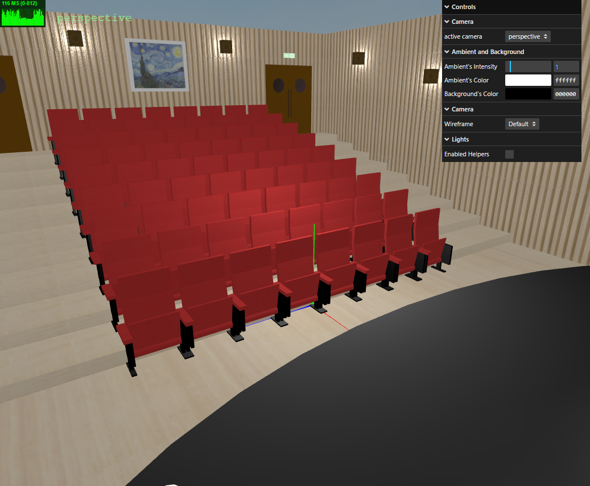
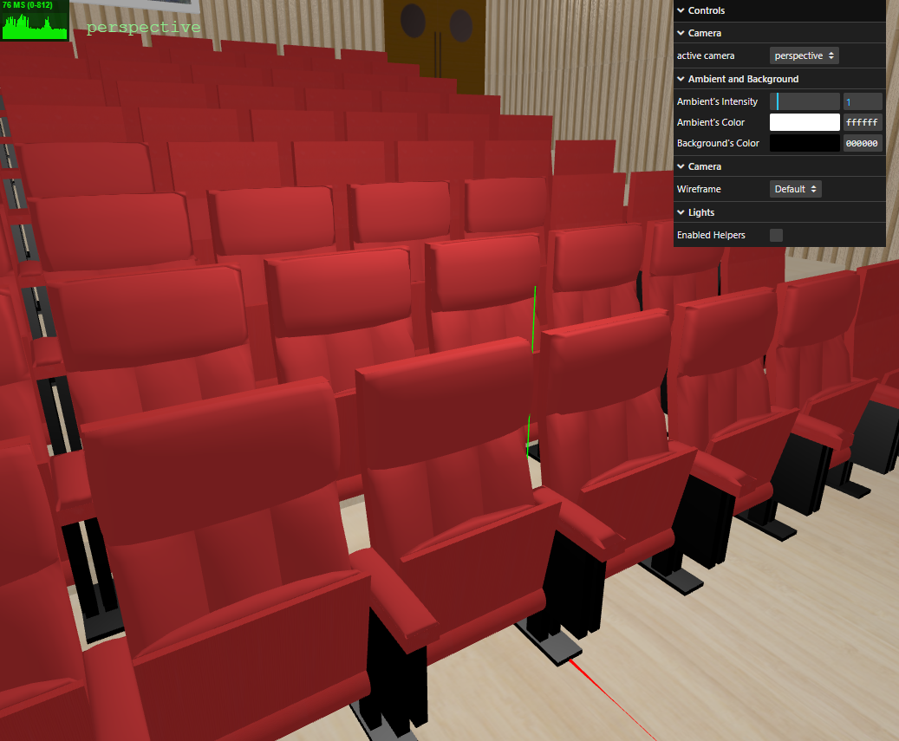
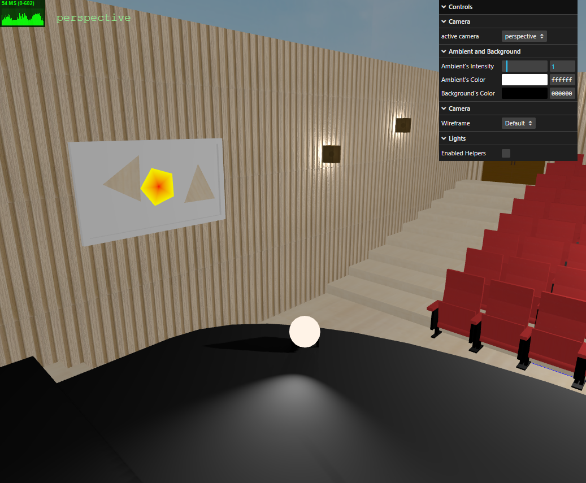
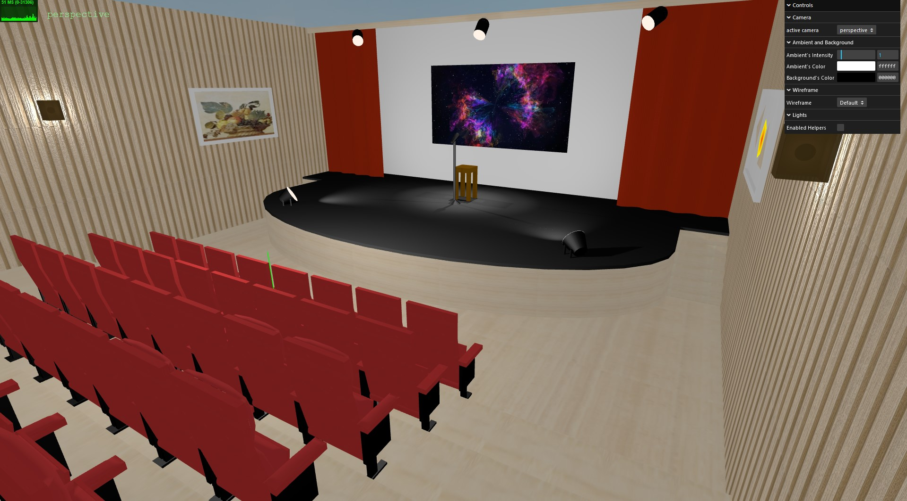

# SGI 2024/2025 - TP2

## Group: T04G08

| Name          | Number    | E-Mail            |
| ------------- | --------- | ----------------- |
| Rita Leite    | 202105309 | up202105309@up.pt |
| Tiago Azevedo | 202108699 | up202108699@up.pt |

---

## Project information

### Strong points

-   Our scene is composed of several objects with different geometries, with one example for each of the geometries that can be represented in our language.

-   Our application respects the hierarchy of materials and shadows.

-   Our application uses the node cloning method, if they have already been created.

### Scene description

-   The scene represents a theater hall.

It consists of two sections, the stage and the audience.

-   In the stage area, there is a raised platform, with stairs on its sides, a pair of curtains and a microphone. To illuminate this area, there are two spotlights on the floor and three on the ceiling.

-   In the audience area, there are several rows of chairs placed on platforms at different heights. To illuminate this area, there are several wall lamps.

-   As decorative elements, there are 3 paintings. The painting with an image of flowers uses the mipmap technique. The painting with three geometric figures demonstrates the use of polygons and triangles.

### Relative link to the scene

Click [here](scenes/scene.json) to go to our scene file.

## Issues/Problems

We didn't had any problems or issues.

## Screenshots

